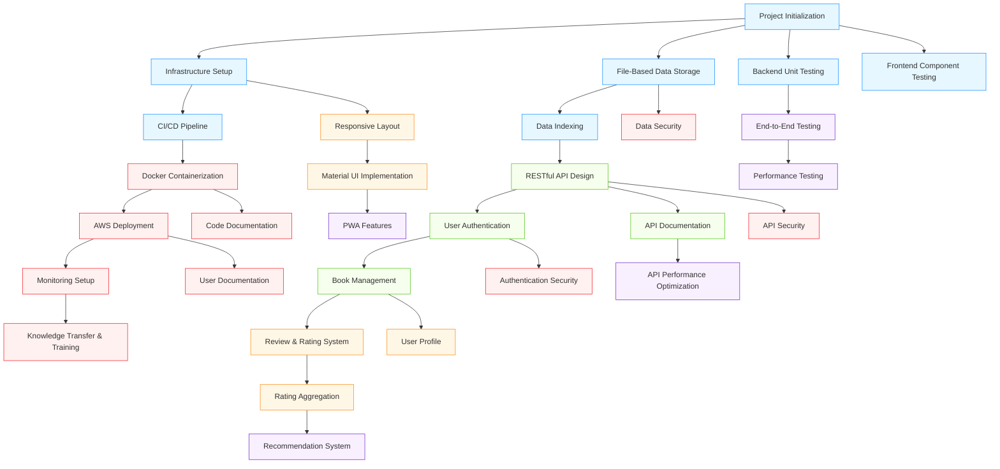

# BookReview Platform Technical Roadmap

## Technology Stack Overview

The BookReview Platform will be built using the following core technologies:

### Frontend
- **Framework**: Next.js with React
- **State Management**: Redux with Redux Thunk
- **UI Components**: Material UI
- **Styling**: CSS-in-JS with Material UI's styling solution
- **Testing**: Jest with React Testing Library
- **Build Tools**: Webpack (integrated with Next.js)

### Backend
- **Runtime**: Node.js
- **Framework**: Express.js
- **API Style**: RESTful with proper versioning
- **Authentication**: JWT-based with bcrypt for password hashing
- **Data Storage**: File-based JSON storage (initial phase)
- **Testing**: Jest with Supertest

### DevOps & Infrastructure
- **Containerization**: Docker
- **Deployment**: AWS (ECS or Elastic Beanstalk)
- **CI/CD**: GitHub Actions
- **Monitoring**: AWS CloudWatch
- **Security**: HTTPS, Content Security Policy, OWASP compliance

## Technical Dependencies and Critical Path

## Technical Decision Points

### Data Storage Strategy
Initially, we will implement a file-based JSON storage system to quickly bootstrap the application. This approach allows us to:

1. Begin development without database setup complexity
2. Define clear data models and access patterns before committing to a database schema
3. Enable easy migration to a database system in future phases

**Decision Point (Week 8):** Evaluate file-based storage performance under load and make a decision on database migration timing.

### Authentication Implementation
We will implement JWT-based authentication with the following considerations:

1. Short-lived access tokens (15-30 minutes)
2. Refresh token rotation for extended sessions
3. Secure storage using HttpOnly cookies with proper attributes
4. CSRF protection mechanisms

**Decision Point (Week 6):** Review authentication implementation with security team before completing social authentication integration.

### Recommendation Engine
The recommendation system will be implemented in two phases:

1. Basic recommendations based on genre, author, and popularity
2. AI-powered recommendations using the OpenAI API

**Decision Point (Week 18):** Evaluate basic recommendation performance and user feedback before proceeding with AI integration.

### Frontend Rendering Strategy
Next.js offers multiple rendering strategies. We will use:

1. Static Site Generation (SSG) for stable content (book details, documentation)
2. Server-Side Rendering (SSR) for dynamic content (user profiles, book listings with filters)
3. Client-side rendering for highly interactive components (review creation, rating)

**Decision Point (Week 7):** Finalize rendering strategy decisions based on performance testing.

## Monitoring & Observability Plan

### Key Metrics to Track

1. **Application Performance**
   - API response times (by endpoint)
   - Page load times
   - Time to interactive
   - CPU and memory usage

2. **User Experience**
   - Client-side errors
   - Page load abandonment
   - API error rates
   - Search latency

3. **Business Metrics**
   - User registration completion rate
   - Review creation rate
   - Search-to-detail view conversion
   - Recommendation click-through rate

### Alerting Strategy

- **Critical Alerts (immediate response):**
  - API availability below 99.9%
  - Error rate exceeds 1% of requests
  - Authentication service failures
  - Data storage errors

- **Warning Alerts (4-hour response):**
  - API response times exceed 500ms for 95th percentile
  - Memory usage exceeds 85% for 5 minutes
  - Failed user registrations exceed 5% of attempts
  - Search failures exceed 2% of attempts

## Technical Debt Management

To manage technical debt effectively, we will:

1. Allocate 20% of each sprint to addressing technical debt
2. Maintain a prioritized backlog of technical improvements
3. Set clear code quality gates in the CI pipeline
4. Conduct bi-weekly architecture reviews

Initial technical debt items to address:

- Implement proper API error handling consistency
- Create comprehensive schema validation
- Refactor file storage access patterns as they evolve
- Establish consistent state management patterns

## Security Implementation Timeline

| Week | Security Implementation |
|------|------------------------|
| 6-7  | Basic authentication security (password policies, secure storage) |
| 10-11 | API security fundamentals (input validation, rate limiting) |
| 14-15 | Session management security |
| 18-19 | Token security hardening |
| 22-23 | Comprehensive security review and remediation |
| 24-25 | Security penetration testing |
| 26-27 | Final security adjustments and documentation |

## Performance Targets

1. **API Performance:**
   - 95% of API requests complete in <200ms
   - 99% of API requests complete in <500ms
   - API can handle 100 concurrent users with <1s response time

2. **Frontend Performance:**
   - First Contentful Paint <1.5s
   - Time to Interactive <2.5s
   - Core Web Vitals passing threshold

3. **Search Performance:**
   - Book search results return in <300ms for most queries
   - Autocomplete suggestions appear in <150ms

## Testing Strategy & Coverage Goals

| Component | Unit Test | Integration Test | E2E Test | Target Coverage |
|-----------|-----------|-----------------|----------|----------------|
| API Controllers | ✅ | ✅ | ✅ | 90% |
| Service Layer | ✅ | ✅ | ⚪ | 85% |
| Data Access | ✅ | ✅ | ⚪ | 80% |
| UI Components | ✅ | ✅ | ✅ | 80% |
| Redux State | ✅ | ✅ | ⚪ | 85% |
| API Integration | ⚪ | ✅ | ✅ | 75% |
| Authentication | ✅ | ✅ | ✅ | 90% |

## Code Quality Gates

The following quality gates will be enforced in the CI pipeline:

1. **Unit test coverage:** Minimum 80% for new code
2. **Code style:** ESLint rules pass with no errors
3. **Security scanning:** No high or critical vulnerabilities
4. **Performance budget:** Bundle size limits (250KB initial JS)
5. **Accessibility:** WCAG 2.1 AA compliance for UI components

## API Design Principles

1. **Versioning:** All endpoints prefixed with `/api/v1/`
2. **Resource-oriented:** Proper use of HTTP methods and status codes
3. **Pagination:** Consistent pagination patterns with page/limit or cursor
4. **Error handling:** Standard error response format
5. **Documentation:** All endpoints documented with OpenAPI/Swagger

## Data Migration Strategy

As the application grows, we will need to migrate from file-based storage to a database. The migration will follow these steps:

1. Implement database schema based on existing data models
2. Create data migration scripts to transform JSON files to database records
3. Implement dual-write capability during transition
4. Validate data integrity between systems
5. Switch read operations to database
6. Complete transition and remove file storage dependencies

## Technical Success Metrics

1. **Code Quality:**
   - Maintain >80% test coverage
   - <5% of PRs requiring major revision
   - <2% of commits reverting previous changes

2. **Deployment Efficiency:**
   - <10 minute CI/CD pipeline execution
   - <3% of deployments requiring rollback
   - <1 hour MTTR (Mean Time To Recovery)

3. **Technical Performance:**
   - <300ms average API response time
   - <2.5s average page load time
   - <1% error rate in production

4. **Security Posture:**
   - 0 critical security findings in production
   - 100% of security vulnerabilities addressed within SLA
   - OWASP Top 10 compliance
